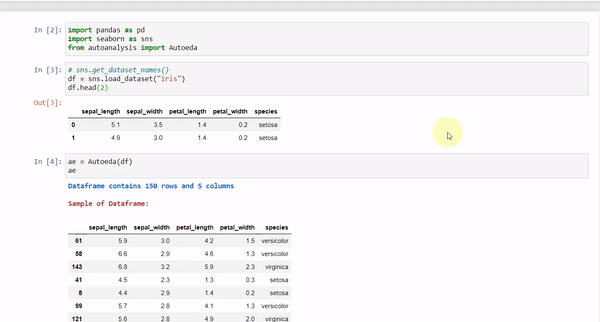

# Data-Purifier

A Python library for Automated Exploratory Data Analysis, Automated Data Cleaning and Automated Data Preprocessing For Machine Learning and Natural Language Processing Applications in Python.

[](https://badge.fury.io/py/data-purifier)
[](https://img.shields.io/pypi/l/ansicolortags.svg) 
[](https://pypi.org/project/data-purifier/)
[](https://pepy.tech/project/data-purifier)


Demo Output of Auto EDA
<br><br>



Table of Contents
- [Data-Purifier](#data-purifier)
  - [Get Started](#get-started)
    - [Automated EDA for NLP](#automated-eda-for-nlp)
    - [Automated Data Cleaning for NLP](#automated-data-cleaning-for-nlp)
  - [Example:](#example)


## Get Started

Install the packages

```bash
pip install data-purifier
```

```bash
python -m spacy download en_core_web_sm
```

Load the module
```python
import datapurifier as dp
from datapurifier import Mleda, Nleda, Nlpurifier

print(dp.__version__)
```

Get the list of the example dataset  
```python
print(dp.get_dataset_names()) # to get all dataset names
print(dp.get_text_dataset_names()) # to get all text dataset names
```

Load an example dataset, pass one of the dataset names from the example list as an argument.```python
df = dp.load_dataset("womens_clothing_e-commerce_reviews")
```

### Automated EDA for Machine Learning

* It gives shape, number of categorical and numerical features, description of the dataset, and also the information about the number of null values and their respective percentage. 

* For understanding the distribution of datasets and getting useful insights, there are many interactive plots generated where the user can select his desired column and the system will automatically plot it. Plot includes
   1. Count plot
   2. Correlation plot
   3. Joint plot
   4. Pair plot
   5. Pie plot 

**Code Implementation**

Load the dataset and let the magic of automated EDA begin

```python
df = pd.read_csv("./datasets/iris.csv")
ae = Mleda(df)
ae
```


### Automated EDA for NLP

**Basic NLP**

* It will check for null rows and drop them (if any) and then will perform following analysis row by row and will return dataframe containing those analysis:
   1. Word Count 
   2. Character Count
   3. Average Word Length
   4. Stop Word Count
   5. Uppercase Word Count

Later you can also observe distribution of above mentioned analysis just by selecting the column from the dropdown list, and our system will automatically plot it.

* It can also perform `sentiment analysis` on dataframe row by row, giving the polarity of each sentence (or row), later you can also view the `distribution of polarity`.

**Word Analysis**

* Can find count of `specific word` mentioned by the user in the textbox.
* Plots `wordcloud plot`
* Perform `Unigram, Bigram, and Trigram` analysis, returning the dataframe of each and also showing its respective distribution plot.

**Code Implementation**


For Automated EDA and Automated Data Cleaning of NL dataset, load the dataset and pass the dataframe along with the targeted column containing textual data.

```python
nlp_df = pd.read_csv("./datasets/twitter16m.csv", header=None, encoding='latin-1')
nlp_df.columns = ["tweets","sentiment"]
```

**Basic Analysis**

For Basic EDA, pass the argument `basic` as argument in constructor
```python
eda = Nlpeda(nlp_df, "tweets", analyse="basic")
eda.df
```
**Word Analysis**

For Word based EDA, pass the argument `word` as argument in constructor
```python
eda = Nlpeda(nlp_df, "tweets", analyse="word")
eda.unigram_df # for seeing unigram datfarame
```


### Automated Data Cleaning for NLP

* It provides following cleaning techniques, where you have to just tick the checkbox and our system will automatically perform the operation for you.

| Features                                   | Features                              | Features                         |
| ------------------------------------------ | ------------------------------------- | -------------------------------- |
| Drop Null Rows                             | Lower all Words                       | Contraction to Expansion         |
| Removal of emojis                          | Removal of emoticons                  | Conversion of emoticons to words |
| Count Urls                                 | Get Word Count                        | Count Mails                      |
| Conversion of emojis to words              | Remove Numbers and Alphanumeric words | Remove Stop Words                |
| Remove Special Characters and Punctuations | Remove Mails                          | Remove Html Tags                 |
| Remove Urls                                | Remove Multiple Spaces                | Remove Accented Characters       |


* You can convert word to its base form by selecting either `stemming` or `lemmatization` option.

* Remove Top Common Word: By giving range of word, you can `remove top common word`
  
* Remove Top Rare Word: By giving range of word, you can `remove top rare word`

After you are done, selecting your cleaning methods or techniques, click on `Start Purifying` button to let the magic begins. Upon its completion you can access the cleaned dataframe by `<obj>.df`

**Code Implementation**

```python
pure = Nlpurifier(nlp_df, "tweets")
```

View the processed and purified dataframe

```python
pure.df
```


## Example: 
https://colab.research.google.com/drive/1J932G1uzqxUHCMwk2gtbuMQohYZsze8U?usp=sharing


Python Package: https://pypi.org/project/data-purifier/


